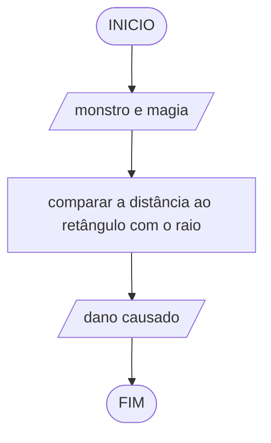

# BEE2632 - Magia e Espada

## Fluxograma

```mermaid
flowchart TD
A([INICIO]) --> B[/"monstro e magia"/]
B --> C["comparar a distância ao retângulo com o raio"]
C --> D[/"dano causado"/]
D --> E([FIM])
```
