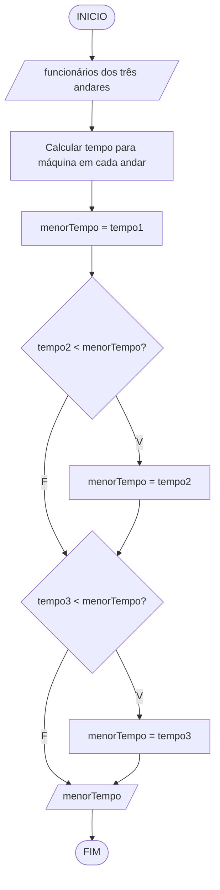

# BEE2670 - Máquina de Café

## Fluxograma

```mermaid
flowchart TD
A([INICIO]) --> B[/"funcionários dos três andares"/]
B --> C["Calcular tempo para máquina em cada andar"]
C --> D["menorTempo = tempo1"]
D --> E{"tempo2 < menorTempo?"}
E -- V --> F["menorTempo = tempo2"]
E -- F --> G{"tempo3 < menorTempo?"}
F --> G
G -- V --> H["menorTempo = tempo3"]
G -- F --> I[/"menorTempo"/]
H --> I
I --> J([FIM])
```
