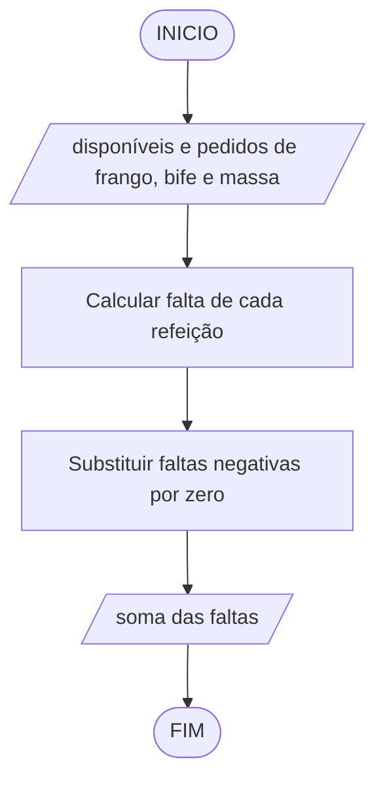

# BEE2702 - Escolha Difícil

## Fluxograma

```mermaid
flowchart TD
A([INICIO]) --> B[/"disponíveis e pedidos de frango, bife e massa"/]
B --> C["Calcular falta de cada refeição"]
C --> D["Substituir faltas negativas por zero"]
D --> E[/"soma das faltas"/]
E --> F([FIM])
```
