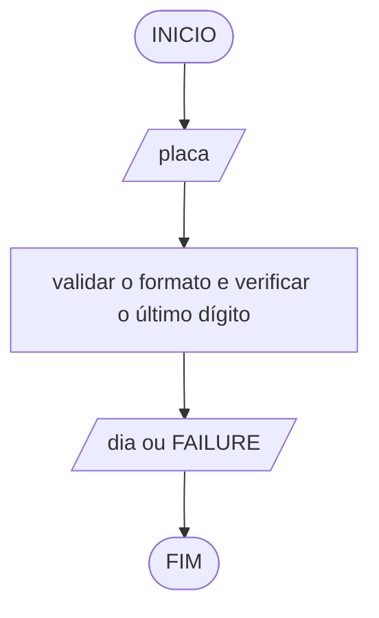

# BEE2712 - Rodízio Veicular

## Fluxograma

```mermaid
flowchart TD
A([INICIO]) --> B[/"placa"/]
B --> C["validar o formato e verificar o último dígito"]
C --> D[/"dia ou FAILURE"/]
D --> E([FIM])
```
