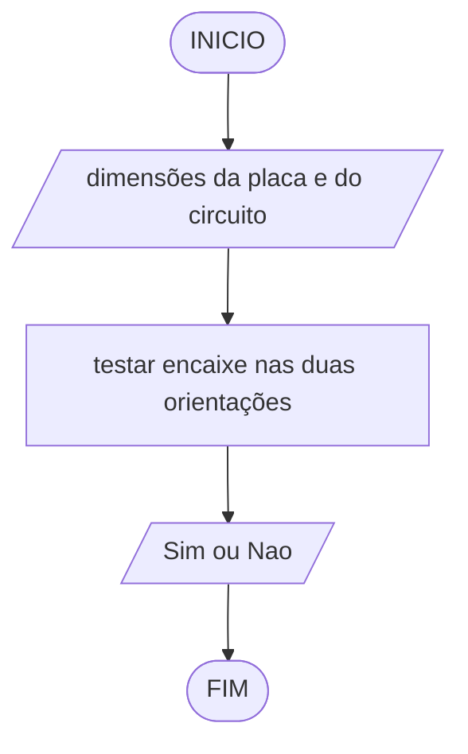

# BEE2770 - Tamanho da Placa

## Fluxograma

```mermaid
flowchart TD
A([INICIO]) --> B[/"dimensões da placa e do circuito"/]
B --> C["testar encaixe nas duas orientações"]
C --> D[/"Sim ou Nao"/]
D --> E([FIM])
```
