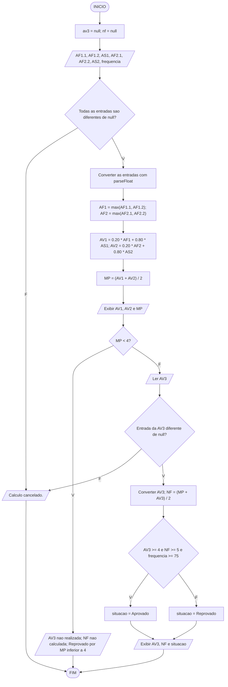

# RLA - Nota final da disciplina

## Enunciado

Escreva um programa que calcule a nota final (NF) de um estudante de Raciocínio Lógico e Algorítmico (RLA) e informe sua situação final.

Em cada uma das duas avaliações (AV1 e AV2), o estudante realiza duas avaliações formativas (AF) e uma avaliação somativa (AS). A maior nota entre as duas AFs tem peso de 20%, enquanto a AS tem peso de 80%:

- `AF1 = max(AF1.1, AF1.2)`;
- `AF2 = max(AF2.1, AF2.2)`;
- `AV1 = 0.20 * AF1 + 0.80 * AS1`;
- `AV2 = 0.20 * AF2 + 0.80 * AS2`.

A média parcial e a nota final são calculadas por:

- `MP = (AV1 + AV2) / 2`;
- `NF = (MP + AV3) / 2`, quando houver nota de AV3.

O estudante é aprovado quando **todas** as condições são atendidas:

- MP maior ou igual a 4;
- AV3 maior ou igual a 4;
- NF maior ou igual a 5;
- frequência maior ou igual a 75%.

Somente estudantes com **MP ≥ 4** podem realizar a AV3. Se MP < 4, o estudante está reprovado, a AV3 não é solicitada e as variáveis `av3` e `nf` permanecem `null`. Ausência de AV3 não equivale a nota zero.

Para quem realiza a AV3, uma NF suficiente não compensa AV3 inferior a 4 ou frequência inferior a 75%.

Neste exercício, as notas de AF e AS já estão disponíveis. A nota de AV3 será informada apenas se MP ≥ 4. Nesse caso, calcule a NF mesmo que a nota da AV3 ou a frequência seja insuficiente para aprovação. AS significa **Avaliação Somativa**.

## Entrada

Leia, por meio de `prompt`, nesta ordem:

1. AF1.1;
2. AF1.2;
3. AS1;
4. AF2.1;
5. AF2.2;
6. AS2;
7. frequência em percentual.

Calcule AV1, AV2 e MP. **Somente se MP ≥ 4**, solicite a nota da AV3 em um novo `prompt`. Não digite o texto `null`: a ausência de AV3 por MP insuficiente é representada pelo próprio programa.

Considere entradas numéricas válidas: notas entre 0 e 10 e frequência entre 0 e 100. Use ponto como separador decimal e informe `75` para uma frequência de 75%. A validação do conteúdo e dos intervalos das entradas está fora do escopo deste exercício.

Se algum diálogo inicial for cancelado, exiba `Calculo cancelado.` e não realize os cálculos. Se o diálogo da AV3 for cancelado por um estudante com MP ≥ 4, mantenha a NF sem cálculo e exiba `Calculo cancelado.` após as médias já exibidas, sem atribuir uma situação final. Esse cancelamento não representa reprovação por MP insuficiente. A verificação de `null` não valida o conteúdo numérico.

## Saída

Exiba AV1, AV2 e MP com duas casas decimais.

- Se MP < 4, exiba `AV3 = nao realizada`, `NF = nao calculada` e `Situacao: Reprovado por MP inferior a 4`.
- Se MP ≥ 4 e a AV3 for informada, exiba AV3 e NF com duas casas decimais, seguidas de `Situacao: Aprovado` ou `Situacao: Reprovado`.

Use os valores sem arredondamento intermediário para decidir a elegibilidade para AV3 e a situação; `toFixed(2)` serve apenas para formatar a exibição.

## Exemplos

| AF1.1 | AF1.2 | AS1 | AF2.1 | AF2.2 | AS2 | AV3 | Frequência | AV1 | AV2 | MP | NF | Situação |
| --- | --- | --- | --- | --- | --- | --- | --- | --- | --- | --- | --- | --- |
| 6 | 8 | 7 | 9 | 7 | 8 | 6 | 80 | 7.20 | 8.20 | 7.70 | 6.85 | Aprovado |
| 6 | 6 | 6 | 6 | 6 | 6 | 4 | 75 | 6.00 | 6.00 | 6.00 | 5.00 | Aprovado |
| 4 | 4 | 4 | 4 | 4 | 4 | 6 | 75 | 4.00 | 4.00 | 4.00 | 5.00 | Aprovado |
| 3 | 3 | 3 | 3 | 3 | 3 | null | 100 | 3.00 | 3.00 | 3.00 | null | Reprovado por MP inferior a 4 |
| 9 | 9 | 9 | 9 | 9 | 9 | 3 | 100 | 9.00 | 9.00 | 9.00 | 6.00 | Reprovado |
| 8 | 8 | 8 | 8 | 8 | 8 | 8 | 74 | 8.00 | 8.00 | 8.00 | 8.00 | Reprovado |
| 4 | 4 | 4 | 4 | 4 | 4 | 4 | 100 | 4.00 | 4.00 | 4.00 | 4.00 | Reprovado |

Na tabela, `null` indica ausência de nota ou de cálculo, não uma entrada digitada.

Saída do primeiro exemplo:

```text
AV1 = 7.20
AV2 = 8.20
MP = 7.70
AV3 = 6.00
NF = 6.85
Situacao: Aprovado
```

## Fluxograma



## Solução em TypeScript

[RLA_NF.ts](RLA_NF.ts)
